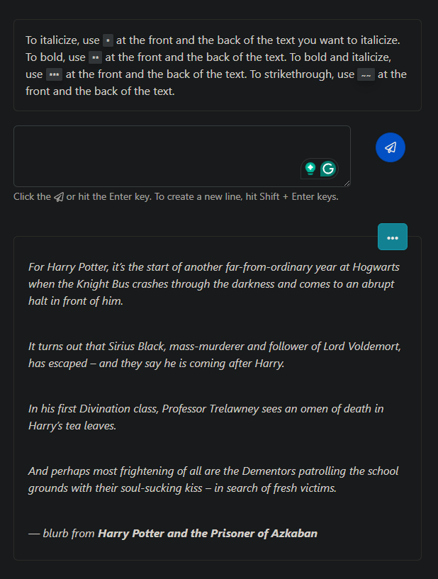

# A Textbox Area Project
 This is the front-end development repository for project textboxarea app.
 The project's goals are:
  - A text box that allows user to create a new post, edit and delete it.
  - Allow users to italicize, bold and strikethrough by using certain keys on keyboard.

## Table of contents

- [Overview](#overview)
  - [Screenshot](#screenshot)
- [My process](#my-process)
  - [Built with](#built-with)
  - [What I learned](#what-i-learned)
- [Author](#author)

## Overview

### Screenshot

## My process

### Built with

- Front-end Development: Reactjs and Bootstrap
- Back-end Development: Laravel 

### What I learned

- CRUD in Laravel using RESTful API
- Eloquent Model in Laravel
- HTML Markups using React Markups

### Continued development

- To include markups that could provide hidden-spoiler for users to use.
- To include pagination 

## Author

- LinkedIn - [Nur Aina Balqis Binti Mohamad Rosidek](https://www.linkedin.com/in/nabbysidek/)
- GitHub - [Nur Aina Balqis Binti Mohamad Rosidek](https://github.com/nabbysidek)